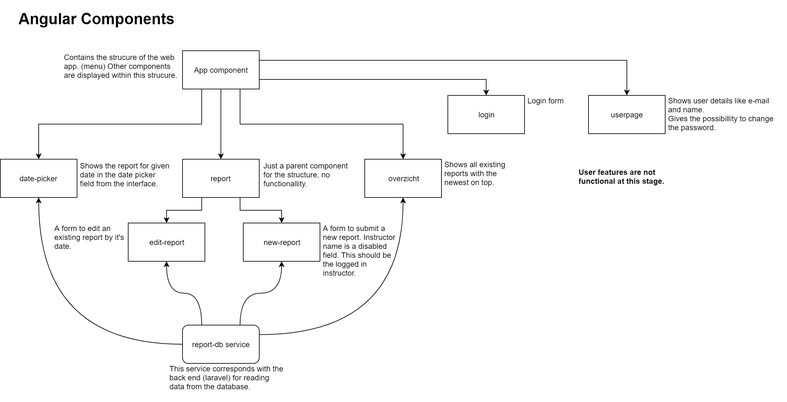

Harald De Vriendt
r0613297
# Project Webservices README #

## Beschrijving ##
Als project maak ik een tool waarop instructeurs van de zweefvliegclub kunnen inloggen en vluchtverslagen kunnen schrijven, opslaan en bekijken. Ik heb besloten om de login nog niet te implementeren omdat ik zo meer con focussen op de andere functionaliteit.

----------

### Documentatie ###
- README
- [Apache](./doc/apache.md)
- [Https](./doc/https.md)
- [Laravel](./doc/laravel.md)

----------

### Vereisten: ###
- Overzicht verslagen
- Nieuw verslag schrijven
- Bestaand verslag bewerken
- Verslag verwijderen
- Verslag zoeken op datum

## Structuur ##
Onderstaande afbeelding geeft een overzicht van de bestaande angular componenten en de onderlinge structuur.

## Extra informatie ##
### Noip DUC ###
Omdat ik mijn server thuis host, en ik geen static ip heb gebruik ik de tool van noip.com **DUC** om mijn ip-adres te achterhalen en een gratis url te laten verwijzen naar het juiste ip adres. 

De tool start op bij het opstarten van windows.

### Port forwarding ###
Om mijn server bereikbaar te maken vanaf het internet moest ik mijn poorten forwarden in de online router configurator van telenet.
